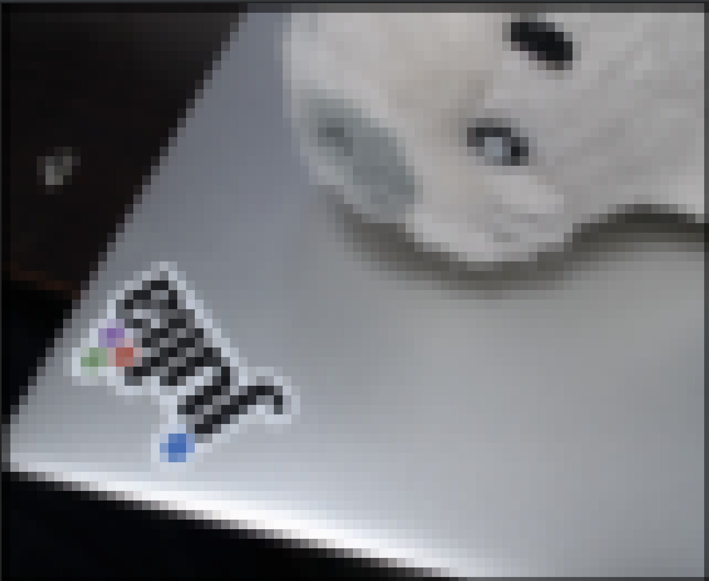

# CameraApp.jl

- Simple Terminal based Julian-application with web camera
- First we take a picture from your web camera using VideoIO.jl, then display the result on your terminal using ImageInTerminal.jl. That's all it's so simple. Below is a result:



## Prerequisite

### Install Julia

- Install Julia from https://julialang.org/downloads/
- If you like to try to run our app on your RaspberryPi, go to get Julia v1.3.1 via https://julialang.org/downloads/oldreleases/
  - For those who desire to run Julia v1.4.0, checkout [Julia-Embedded/jlcross](https://github.com/Julia-Embedded/jlcross)

### Clone [this repository](https://github.com/terasakisatoshi/CameraApp.jl)

```console
$ cd ~/work # path to your workspace
$ git clone https://github.com/terasakisatoshi/CameraApp.jl.git
```

### set up environment

- We will assume you can call Julia via `julia`

```
$ cd ~/work # path to your workspace
$ cd CameraApp.jl
$ ls
LICENSE     Manifest.toml   Project.toml    README.md   README_ja.md    src
$ julia --project=. -e "using Pkg; Pkg.instantiate()"
  Updating registry at `~/.julia/registries/General`
  Updating git-repo `https://github.com/JuliaRegistries/General.git`
 Resolving package versions...
 Installed ColorVectorSpace ─ v0.8.4
 Installed ImageInTerminal ── v0.4.3
  Updating `~/CameraApp.jl/Project.toml`
  [d8c32880] + ImageInTerminal v0.4.3
  [d6d074c3] + VideoIO v0.6.11
  Updating `~/CameraApp.jl/Manifest.toml`
  [13072b0f] + AxisAlgorithms v1.0.0
  [b99e7846] + BinaryProvider v0.5.8
  [3da002f7] + ColorTypes v0.9.1
  [c3611d14] + ColorVectorSpace v0.8.4
  [5ae59095] + Colors v0.11.2
  [34da2185] + Compat v2.2.0
  [e66e0078] + CompilerSupportLibraries_jll v0.3.2+0
  [150eb455] + CoordinateTransformations v0.5.1
  [a8cc5b0e] + Crayons v4.0.1
  [9a962f9c] + DataAPI v1.1.0
  [864edb3b] + DataStructures v0.17.10
  [c87230d0] + FFMPEG v0.2.4
  [53c48c17] + FixedPointNumbers v0.7.1
  [c27321d9] + Glob v1.2.0
  [a2bd30eb] + Graphics v1.0.2
  [bbac6d45] + IdentityRanges v0.3.1
  [a09fc81d] + ImageCore v0.8.12
  [d8c32880] + ImageInTerminal v0.4.3
  [02fcd773] + ImageTransformations v0.8.4
  [a98d9a8b] + Interpolations v0.12.9
  [dbb5928d] + MappedArrays v0.2.2
  [e1d29d7a] + Missings v0.4.3
  [77ba4419] + NaNMath v0.3.3
  [6fe1bfb0] + OffsetArrays v1.0.4
  [efe28fd5] + OpenSpecFun_jll v0.5.3+3
  [bac558e1] + OrderedCollections v1.1.0
  [5432bcbf] + PaddedViews v0.5.3
  [92933f4c] + ProgressMeter v1.2.0
  [c84ed2f1] + Ratios v0.4.0
  [189a3867] + Reexport v0.2.0
  [ae029012] + Requires v1.0.1
  [6038ab10] + Rotations v0.13.0
  [a2af1166] + SortingAlgorithms v0.3.1
  [276daf66] + SpecialFunctions v0.10.0
  [90137ffa] + StaticArrays v0.12.1
  [2913bbd2] + StatsBase v0.32.2
  [d6d074c3] + VideoIO v0.6.11
  [efce3f68] + WoodburyMatrices v0.5.2
  [2a0f44e3] + Base64
  [ade2ca70] + Dates
  [8bb1440f] + DelimitedFiles
  [8ba89e20] + Distributed
  [b77e0a4c] + InteractiveUtils
  [76f85450] + LibGit2
  [8f399da3] + Libdl
  [37e2e46d] + LinearAlgebra
  [56ddb016] + Logging
  [d6f4376e] + Markdown
  [a63ad114] + Mmap
  [44cfe95a] + Pkg
  [de0858da] + Printf
  [3fa0cd96] + REPL
  [9a3f8284] + Random
  [ea8e919c] + SHA
  [9e88b42a] + Serialization
  [1a1011a3] + SharedArrays
  [6462fe0b] + Sockets
  [2f01184e] + SparseArrays
  [10745b16] + Statistics
  [8dfed614] + Test
  [cf7118a7] + UUIDs
  [4ec0a83e] + Unicode

```

### How to run

```
$ cd ~/work # path to your workspace
$ cd CameraApp.jl
$ ls
LICENSE     Manifest.toml   Project.toml    README.md   README_ja.md    src
$ julia -q --project=.
julia> using CameraApp
julia> demo()
```

# Appendix: build application via PackageCompiler.jl

- Just Run

```console
$ julia --project=. -e 'include("build.jl")'
$ ./build/bin/CameraApp
```

which is equivalent to

```console
$ julia -q --project=.
julia> include("build.jl")
julia> exit()
$ ./build/bin/CameraApp
```
